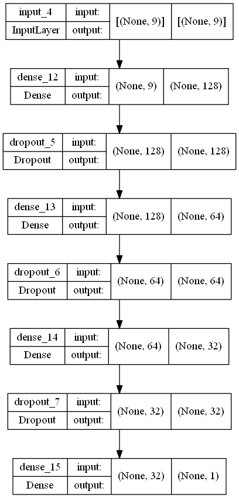
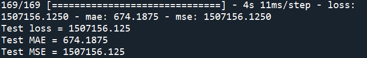
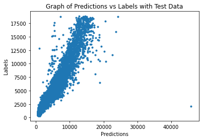

# Project-Diamond-Price-Prediction-Using-Feedforward-Neural-Network

## 1. Summary
The goal of this project is to predict the price of diamond, based on the following features:
- 4C (cut,clarity,color,carat)
- dimensions (x,y,z)
- depth
- table

The dataset is obtained from [here](https://www.kaggle.com/datasets/shivam2503/diamonds).

## 2. IDE and Framework
This project is created using Sypder as the main IDE. The main frameworks used in this project are Pandas, Numpy, Scikit-learn and TensorFlow Keras.

## 3. Methodology
### 3.1. Data Pipeline
The data is first loaded and preprocessed, such that unwanted features are removed. Categorical features are encoded ordinally. 
Then the data is split into train-validation-test sets, with a ratio of 60:20:20.

### 3.2. Model Pipeline
A feedforward neural network is constructed that is catered for regression problem. The structure of the model is fairly simple. Figure below shows the structure of the model.

The model is trained with a batch size of 64 and for 100 epochs. Early stopping is applied in this training. The training stops at epoch 25, 
with a training MAE of 902 and validation MAE of 660. The two figures below show the graph of the training process, indicating the convergence of model training.

 

## 4. Results
The model are tested with test data. The evaluation result is shown in figure below.

The model is also used to made prediction with test data. A graph of prediction vs label is plotted, as shown in the image below.

Based on the graph, a clear trendline of y=x can be seen, indicating the predictions are fairly similar as labels. However, several outliers can be seen in the graph.

